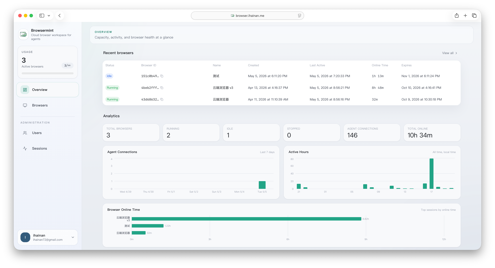
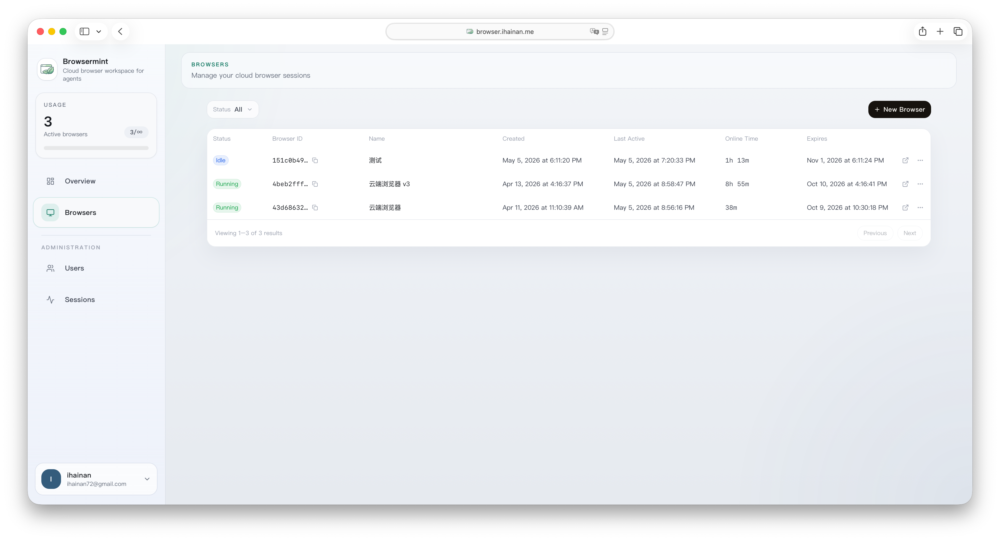
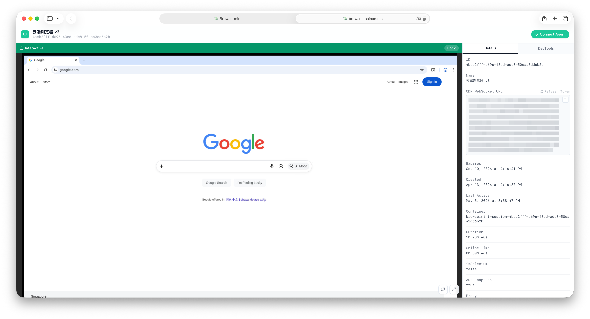
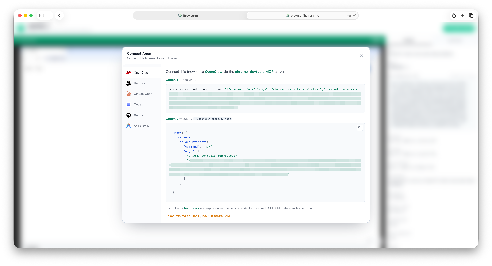
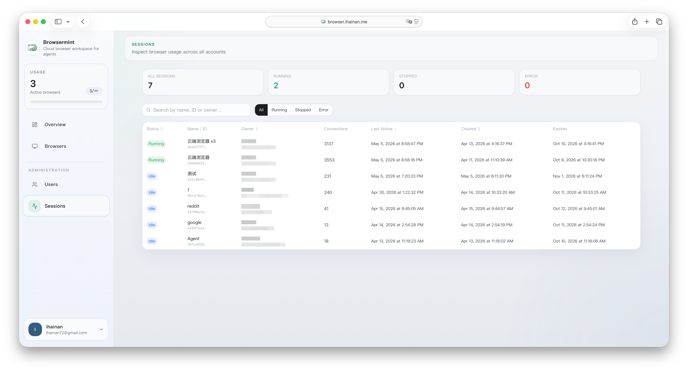

<div align="center">


# Browsermint

<!-- Build status badge goes here, e.g.:
[](https://github.com/your-org/browsermint/actions/workflows/ci.yml)
-->
[](LICENSE)

A self-hosted browser session management platform.  
Each session runs as an isolated Chrome container on your own infrastructure,  
accessible via CDP or a live VNC view in the browser.

[Quick Start](#quick-start) · [Configuration](#configuration-reference) · [Usage](#usage) · [Development](#development)

</div>

---



---

## Features

- **Isolated Chrome sessions** — every session runs in its own Docker container with a dedicated user profile; cookies, localStorage, and extensions are fully isolated
- **CDP / Steel Browser API compatible** — connect any CDP client, Puppeteer, Playwright, or Steel-compatible SDK directly to a session endpoint
- **AI Agent integration** — one-click MCP configuration for Claude Code, Cursor, Codex, and other MCP-compatible agents via the chrome-devtools MCP server
- **Live browser view** — open any session in a browser tab to watch or interact with it in real time via noVNC
- **Idle auto-pause** — sessions that have had no active WebSocket connections for a configurable timeout are automatically paused to free host resources; they resume on the next connection
- **Session auto-recovery** — after a host reboot or Docker daemon restart, the reconcile loop automatically restarts exited containers and re-attaches CDP without manual intervention
- **Multi-user with per-user session limits** — each user gets their own sessions; admins can set a maximum concurrent session count per user
- **Admin panel** — manage users and view all sessions across the platform
- **CapSolver integration** — optional automatic CAPTCHA solving via [CapSolver](https://capsolver.com)

---

## Architecture

```
Browser / API client
        │
        ▼
   ┌─────────┐   HTTP / WS   ┌───────────┐
   │  Nginx  │ ─────────────▶│  Frontend │  (React + Vite)
   │ (proxy) │               └───────────┘
   │         │   HTTP / WS   ┌───────────┐   Docker API   ┌────────────────────┐
   │         │ ─────────────▶│  Backend  │ ──────────────▶│  Browser containers│
   └─────────┘               │ (Fastify) │                │  (Chrome + noVNC)  │
                             └─────┬─────┘                └────────────────────┘
                                   │ Prisma
                             ┌─────▼─────┐
                             │ PostgreSQL │
                             └───────────┘
```

The backend manages container lifecycle via the Docker socket. Browser containers run on a dedicated internal Docker network (`browsermint-internal`) that is not exposed externally; the backend proxies CDP WebSocket connections to them.

---

## Quick Start

### Prerequisites

- Docker Engine 24+ with the Compose plugin
- A Linux host (the backend mounts `/var/run/docker.sock`)

### 1. Clone and configure

```bash
git clone https://github.com/your-org/browsermint.git
cd browsermint/docker
cp .env.example .env
```

Open `.env` and fill in the required values:

```dotenv
POSTGRES_DATA_DIR=/opt/browsermint/postgres   # absolute path on host

# Generate with: openssl rand -hex 32
JWT_SECRET=<your-secret>
JWT_SESSION_TOKEN_SECRET=<your-secret>

POSTGRES_PASSWORD=<your-db-password>
```

### 2. Build the browser image

The browser image is a thin wrapper around [Steel Browser](https://github.com/steel-dev/steel-browser). Build it once before the first deploy:

```bash
docker compose build browser
```

### 3. Start the stack

```bash
docker compose up -d
```

The web UI is available at `http://<host>:24700` (configurable via `NGINX_PORT`).

### 4. Create your first user

Open the UI and register. The first registered user automatically becomes an admin.

---

## Configuration Reference

All settings are controlled via environment variables in `docker/.env`.

| Variable | Default | Description |
|---|---|---|
| `NGINX_PORT` | `24700` | External port exposed by Nginx |
| `POSTGRES_PASSWORD` | — | **Required.** PostgreSQL password |
| `POSTGRES_DATA_DIR` | — | **Required.** Host path for PostgreSQL data volume |
| `JWT_SECRET` | — | **Required.** ≥ 32-char secret for auth cookies |
| `JWT_SESSION_TOKEN_SECRET` | — | **Required.** ≥ 32-char secret for session WebSocket tokens |
| `DOCKER_NETWORK_NAME` | `browsermint-internal` | Docker network that browser containers join |
| `STEEL_BROWSER_IMAGE` | `ihainan/browsermint-browser:0.5.1` | Browser container image |
| `DEFAULT_USER_MAX_SESSIONS` | `2` | Max concurrent sessions per new user (`0` = unlimited) |
| `IDLE_PAUSE_ENABLED` | `true` | Pause sessions after idle timeout |
| `IDLE_PAUSE_TIMEOUT_MS` | `600000` | Idle timeout in milliseconds (default 10 min) |
| `REGISTRATION_MODE` | `open` | `open` allows self-registration; `disabled` requires admin invite |
| `CAPSOLVER_API_KEY` | _(empty)_ | CapSolver API key for automatic CAPTCHA solving |
| `COOKIE_SECURE` | `true` | Set to `false` if not using HTTPS (e.g., plain HTTP on LAN) |
| `SESSION_TOKEN_EXPIRY` | `180d` | Expiry for session WebSocket JWT tokens |

---

## Usage

### Managing sessions



The **Browsers** page lists all your sessions with their status, online time, and expiry. Click **+ New Browser** to spin up a fresh Chrome container in seconds.

### Live browser view



Click on any session to open the live noVNC view. You can interact with the browser directly from the UI — useful for debugging automation scripts or handling manual steps mid-run. The right-hand panel shows session details and the CDP WebSocket URL.

### Connecting an AI Agent



Click **Connect Agent** on any session to get a one-click MCP configuration for Claude Code, Cursor, Codex, and other MCP-compatible agents. The dialog generates a ready-to-use `chrome-devtools` MCP server config that points the agent at the session's CDP endpoint.

### Connecting via CDP

Each session also exposes a raw CDP WebSocket endpoint for Puppeteer, Playwright, or any CDP-compatible client:

```js
// Puppeteer example
import puppeteer from "puppeteer";

const browser = await puppeteer.connect({
  browserWSEndpoint: "ws://<host>:<port>/sessions/<session-id>/cdp?token=<token>",
});
const page = await browser.newPage();
await page.goto("https://example.com");
```

### Admin panel



Admins can view all sessions across all users, filter by status, adjust per-user session limits, and manage accounts.

---

## Development

### Requirements

- Node.js 20+
- Docker (for browser containers and local PostgreSQL)

### Backend

```bash
cd backend
cp .env.example .env   # adjust DATABASE_URL and other vars
npm install
npx prisma migrate dev
npm run dev
```

### Frontend

```bash
cd frontend
npm install
npm run dev
```

### Tests

```bash
# Unit + integration tests (no Docker required)
make test-fast

# Full E2E smoke test against a real compose stack
make test-e2e

# Keep the created session after E2E for debugging
make test-e2e-keep
```

See [Test Entrypoints](#test-entrypoints) for details on each suite.

---

## Upgrading

```bash
git pull
cd docker
docker compose build --no-cache
docker compose up -d
```

Database migrations run automatically on backend startup via `prisma migrate deploy`.

---

## Test Entrypoints

### Fast Tests

Use the fast suite for normal development and CI checks that do not require Docker browser containers:

```bash
make test-fast
```

This runs:

- `npm --prefix backend test`
- `npm --prefix backend run build`
- `npm --prefix frontend test`
- `npm --prefix frontend run build`

Individual targets:

```bash
make test-backend
make test-frontend
make build
```

### Docker E2E Smoke

Use the Docker E2E smoke test to validate the real compose stack, real browser containers, and real proxy/WebSocket paths:

```bash
make test-e2e
```

The E2E script will:

- prepare `docker/.env` with local-only defaults if required values are missing
- ensure the configured browser image exists, building the compose `browser` service if necessary
- run `docker compose up -d --build` from `docker/` when services are not already running
- register or login the E2E test user
- create a real browser session, exercise HTTP proxy APIs, CDP WebSocket, cast/logs/pageId WebSockets, stealth/passkey checks, session events, and admin checks
- delete the session it created unless `--keep-session` is passed

Useful variants:

```bash
make test-e2e-keep                                   # keep the session for debugging
make test-e2e-down                                   # run E2E, then docker compose down
python3 test_e2e.py --base-url http://localhost:24900
python3 test_e2e.py --skip-docker
python3 test_e2e.py --down-after --down-volumes
```

---

## Docker Helpers

```bash
make docker-up    # start the compose stack
make docker-down  # stop the compose stack
```

---

## Acknowledgements

Browsermint builds on [Steel Browser](https://github.com/steel-dev/steel-browser) by [Steel Dev](https://steel.dev), which provides the underlying Chrome container with CDP, stealth patches, and session management APIs. Steel Browser is licensed under the [Apache 2.0 License](https://github.com/steel-dev/steel-browser/blob/main/LICENSE).

---

## License

Browsermint is licensed under the [Apache 2.0 License](LICENSE).
